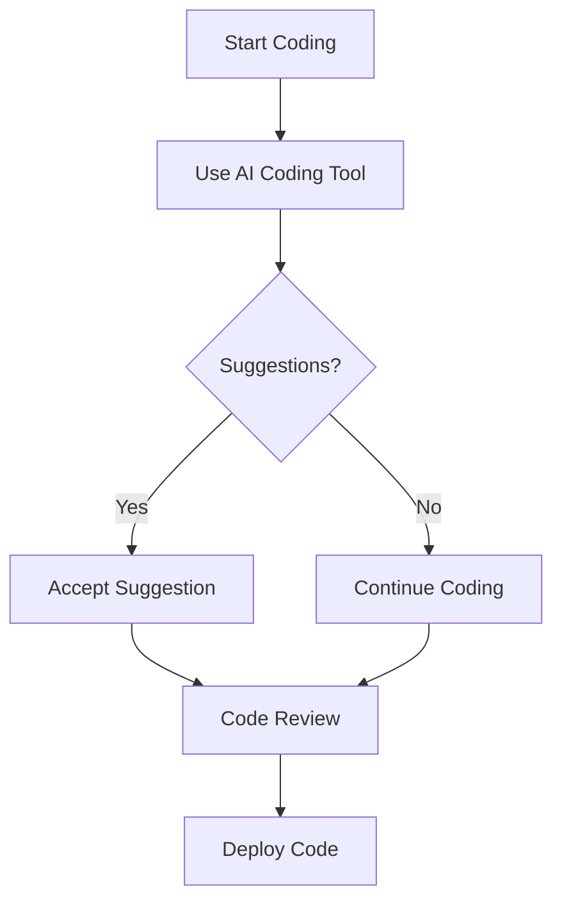

---

# Top AI Coding Tools That Enhance Developer Efficiency

In today’s fast-paced tech landscape, staying ahead of the game is crucial for developers. Enter AI coding tools: these innovative solutions harness the power of artificial intelligence to improve productivity, enhance code quality, and simplify the development process. In this post, we’ll explore some of the top AI coding tools available, how they can boost your efficiency, and what you should consider when choosing the right tool for your needs.

## Why Use AI Coding Tools?

Before diving into specific tools, let’s discuss why AI coding tools are becoming essential in the developer toolkit. 

1. **Increased Productivity**: AI coding tools can automate repetitive tasks, allowing developers to focus on more complex problems. 
2. **Code Quality Improvement**: With features like automated testing and code reviews, these tools help ensure that your code meets high-quality standards.
3. **Learning and Development**: Many AI coding tools offer suggestions and context-aware code snippets, helping developers learn and adopt best practices in real-time.

Let’s look at some of the most effective AI coding tools that can significantly enhance your efficiency.

## Top AI Coding Tools

### 1. GitHub Copilot

[GitHub Copilot](https://github.com/features/copilot?ref=AFFILIATE_ID) is an AI-powered code completion tool that provides developers with intelligent code suggestions based on the context of the project. It works within the Visual Studio Code editor, making it a seamless addition to your workflow.

#### Pros:
- Context-aware suggestions that adapt to your coding style.
- Supports numerous programming languages.
- Increases coding speed by suggesting entire lines or blocks of code.

#### Cons:
- May generate incorrect or suboptimal code suggestions.
- Requires an internet connection to function.

### 2. TabNine

TabNine is another AI coding assistant that uses machine learning to provide code completion suggestions. Unlike GitHub [Copilot](https://github.com/features/copilot?ref=AFFILIATE_ID), it can work with multiple IDEs, making it flexible for various development environments.

#### Pros:
- Works with any programming language.
- Offers local and cloud-based models for enhanced privacy.
- Can be customized to suit your coding style.

#### Cons:
- The free version has limited features.
- Performance may vary depending on the model used.

### 3. DeepCode (now part of Snyk)

DeepCode leverages AI to perform static code analysis and identify potential bugs and vulnerabilities in your codebase. It integrates with your existing workflow, providing real-time feedback as you write code.

#### Pros:
- Detects security issues and anti-patterns effectively.
- Offers integration with popular version control systems.
- Provides actionable insights for code improvement.

#### Cons:
- May produce false positives, requiring developer discretion.
- Limited support for less popular programming languages.

### 4. CodeWhisperer

Amazon's CodeWhisperer is an AI coding companion designed to help developers write code faster and more efficiently. It integrates with Amazon Web Services (AWS) and supports multiple programming languages.

#### Pros:
- Excellent integration with AWS services.
- Supports various programming languages.
- Cloud-based, making it accessible from anywhere.

#### Cons:
- Best suited for developers working within the AWS ecosystem.
- Limited functionality outside of AWS-related projects.

### 5. Kite

Kite is an AI-powered coding assistant that provides code suggestions and documentation as you write. It features a unique “line-of-code” completion model that helps developers code faster.

#### Pros:
- Supports over 16 programming languages.
- Integrates with various code editors.
- Provides documentation snippets alongside code suggestions.

#### Cons:
- Performance can vary based on internet speed.
- The free version has limited features compared to the Pro version.

## Comparison of AI Coding Tools

To help you choose the right tool, here’s a quick comparison of the features of the AI coding tools mentioned above:

<table>
  <tr>
    <th>Feature</th>
    <th>GitHub Copilot</th>
    <th>TabNine</th>
    <th>DeepCode</th>
    <th>CodeWhisperer</th>
    <th>Kite</th>
  </tr>
  <tr>
    <td>Context-Aware Suggestions</td>
    <td>Yes</td>
    <td>Yes</td>
    <td>No</td>
    <td>Yes</td>
    <td>Yes</td>
  </tr>
  <tr>
    <td>Multiple Language Support</td>
    <td>Yes</td>
    <td>Yes</td>
    <td>Limited</td>
    <td>Yes</td>
    <td>Yes</td>
  </tr>
  <tr>
    <td>Integration with IDEs</td>
    <td>Visual Studio Code</td>
    <td>Multiple IDEs</td>
    <td>Popular VCS</td>
    <td>AWS IDEs</td>
    <td>Multiple Editors</td>
  </tr>
  <tr>
    <td>Static Code Analysis</td>
    <td>No</td>
    <td>No</td>
    <td>Yes</td>
    <td>No</td>
    <td>No</td>
  </tr>
  <tr>
    <td>Cloud/Local Model Support</td>
    <td>Cloud</td>
    <td>Both</td>
    <td>Cloud</td>
    <td>Cloud</td>
    <td>Cloud</td>
  </tr>
</table>

## Workflow Integration

To illustrate how AI coding tools can fit into your existing workflow, let’s look at a simple workflow diagram:

This diagram shows a streamlined workflow where developers can leverage AI tools for suggestions, thus enhancing their coding process.

## Choosing the Right AI Coding Tool

When selecting the best AI coding tool for your needs, consider the following factors:

1. **Integration**: Make sure the tool integrates with your existing development environment.
2. **Language Support**: Check if the tool supports the programming languages you primarily use.
3. **Functionality**: Assess whether you need just code completion or additional features like static analysis.
4. **Cost**: Consider your budget and whether a free or paid version fits your needs.

## Conclusion

AI coding tools are revolutionizing the way developers work, allowing for faster coding, improved code quality, and an overall more efficient development process. Whether you choose GitHub Copilot, TabNine, or any of the other mentioned tools, integrating AI into your workflow can provide significant benefits.

Are you ready to enhance your coding efficiency with AI tools? Explore these options and find the one that best fits your coding style and workflow. Happy coding!

## 関連記事

- [AI Coding Tools: Boosting Developer Efficiency in 2026](/posts/ai-coding-tools-boosting-developer-efficiency-in-2026/)
- [How AI Coding Tools are Revolutionizing Software Development](/posts/how-ai-coding-tools-are-revolutionizing-software-development/)
- [How AI Coding Tools Boost Developer Efficiency in 2026](/posts/how-ai-coding-tools-boost-developer-efficiency-in-2026/)
