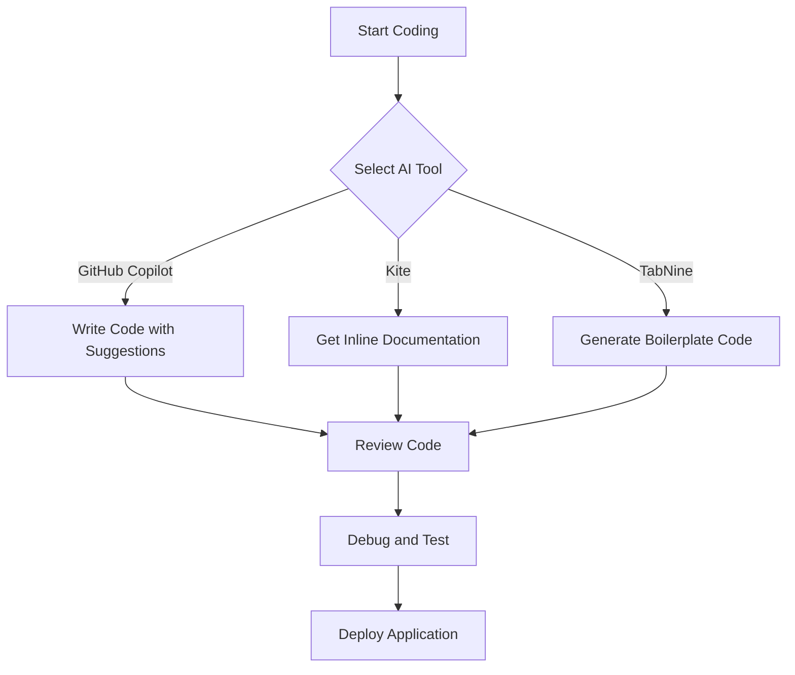

---

# Top AI Coding Tools to Boost Developer Efficiency Today

The world of software development is evolving rapidly, and the integration of artificial intelligence (AI) into coding tools is at the forefront of this transformation. AI coding tools are designed to streamline and enhance the development process, making it easier and faster for developers to write, debug, and maintain code. In this article, we will explore some of the best AI coding tools available today, highlighting their features, pros and cons, and use cases that can boost your productivity.

## What Are AI Coding Tools?

AI coding tools leverage machine learning algorithms and natural language processing to assist developers in various coding tasks. They can automate repetitive tasks, suggest code snippets, identify bugs, and even generate entire functions. The goal is to reduce the cognitive load on developers, allowing them to focus on more complex problem-solving and creativity.

## Why Use AI Coding Tools?

Using AI coding tools can significantly improve developer efficiency. Here are a few reasons to consider integrating them into your workflow:

- **Increased Productivity**: Automate mundane tasks and provide quick code suggestions, saving time.
- **Error Reduction**: AI tools can catch bugs early in the development process, minimizing costly debugging later.
- **Learning Aid**: These tools can help new developers learn coding standards and best practices.

## The Top AI Coding Tools

### 1. GitHub Copilot

[GitHub Copilot](https://github.com/features/copilot?ref=AFFILIATE_ID) is an AI-powered code completion tool developed by GitHub in collaboration with OpenAI. It uses the OpenAI Codex model to provide real-time code suggestions in various programming languages.

#### Pros:
- Extensive language support (Python, JavaScript, TypeScript, Ruby, etc.)
- Context-aware suggestions based on the code you’re writing
- Integrates seamlessly with popular IDEs like Visual Studio Code

#### Cons:
- May suggest outdated or insecure code
- Requires an active internet connection for optimal performance

#### Use Case:
Imagine a developer working on a web application. As they start typing a function to fetch data from an API, GitHub [Copilot](https://github.com/features/copilot?ref=AFFILIATE_ID) provides a complete function suggestion based on the context, significantly speeding up the development process.

### 2. Kite

Kite is another powerful AI coding assistant that supports over 16 languages and offers a robust code completion feature. It also includes a unique feature called "Kite [Copilot](https://github.com/features/copilot?ref=AFFILIATE_ID)," which provides documentation and examples inline.

#### Pros:
- Fast and efficient code completions
- Inline documentation and examples for better understanding
- Works with multiple editors (VS Code, PyCharm, Atom, etc.)

#### Cons:
- Limited support for some niche programming languages
- The learning curve for new users

#### Use Case:
A data scientist using Python can leverage Kite to get quick insights into function parameters and library usage right within their IDE, enhancing their coding speed and accuracy.

### 3. TabNine

TabNine is an AI-powered code completion tool that uses deep learning to provide intelligent code suggestions. It can be integrated with various editors and supports multiple programming languages.

#### Pros:
- Extremely fast and responsive
- Supports a wide range of programming languages
- Customizable through its training on your own codebase

#### Cons:
- The free version has limited features
- May require some configuration for optimal performance

#### Use Case:
A full-stack developer can utilize TabNine to generate boilerplate code quickly, allowing them to focus on building unique features rather than repetitive tasks.

### Comparison Table of AI Coding Tools

<table>
  <tr>
    <th>Tool</th>
    <th>Language Support</th>
    <th>IDE Integration</th>
    <th>Unique Feature</th>
  </tr>
  <tr>
    <td>[GitHub Copilot](https://github.com/features/copilot?ref=AFFILIATE_ID)</td>
    <td>Python, JavaScript, TypeScript, Ruby, etc.</td>
    <td>Visual Studio Code, JetBrains IDEs</td>
    <td>Context-aware suggestions</td>
  </tr>
  <tr>
    <td>Kite</td>
    <td>Python, JavaScript, Go, etc.</td>
    <td>VS Code, PyCharm, Atom</td>
    <td>Inline documentation</td>
  </tr>
  <tr>
    <td>TabNine</td>
    <td>Multiple languages</td>
    <td>VS Code, Sublime Text, Atom</td>
    <td>Customizable training</td>
  </tr>
</table>

### 4. Codeium

[Codeium](https://codeium.com/?ref=AFFILIATE_ID) is an emerging AI coding tool that aims to provide developers with an efficient coding experience. It boasts real-time collaboration capabilities and a large library of code snippets.

#### Pros:
- Real-time collaboration features for team projects
- Extensive code snippet library
- Supports multiple programming languages

#### Cons:
- Still in the development phase with potential bugs
- Limited community support compared to more established tools

#### Use Case:
A development team working on a collaborative project can benefit from [Codeium](https://codeium.com/?ref=AFFILIATE_ID)’s features by sharing code snippets and reviewing each other’s suggestions in real-time, enhancing teamwork and productivity.

### 5. Sourcery

Sourcery is an AI tool specifically focused on improving Python code quality. It analyzes your code and provides refactoring suggestions to enhance readability and maintainability.

#### Pros:
- Focused on Python, making it very effective for Python developers
- Helps maintain code quality and best practices
- Provides actionable suggestions for improvement

#### Cons:
- Limited to Python, making it unsuitable for multi-language projects
- Requires understanding of refactoring suggestions

#### Use Case:
A Python developer can run Sourcery on their codebase to receive suggestions on improving function names and simplifying complex expressions, leading to cleaner code.

## Workflow of Using AI Coding Tools

To illustrate how AI coding tools can fit into a developer's workflow, here's a simple diagram:

## Conclusion

AI coding tools are revolutionizing the way developers write code, making the process faster and more efficient. Whether you choose GitHub Copilot for its context-aware suggestions, Kite for its inline documentation, or TabNine for its speed and customization, incorporating these tools into your workflow can lead to significant productivity gains.

Are you ready to enhance your coding experience? Explore these AI coding tools today and start unlocking your full potential as a developer! 

**Call to Action**: Visit our website, AI Tools Lab, to discover detailed reviews, user experiences, and more about the latest AI coding tools that can help you streamline your development process!

## 関連記事

- [AI Coding Tools: Boosting Developer Efficiency in 2026](/posts/ai-coding-tools-boosting-developer-efficiency-in-2026/)
- [How AI Coding Tools are Revolutionizing Software Development](/posts/how-ai-coding-tools-are-revolutionizing-software-development/)
- [How AI Coding Tools Boost Developer Efficiency in 2026](/posts/how-ai-coding-tools-boost-developer-efficiency-in-2026/)
