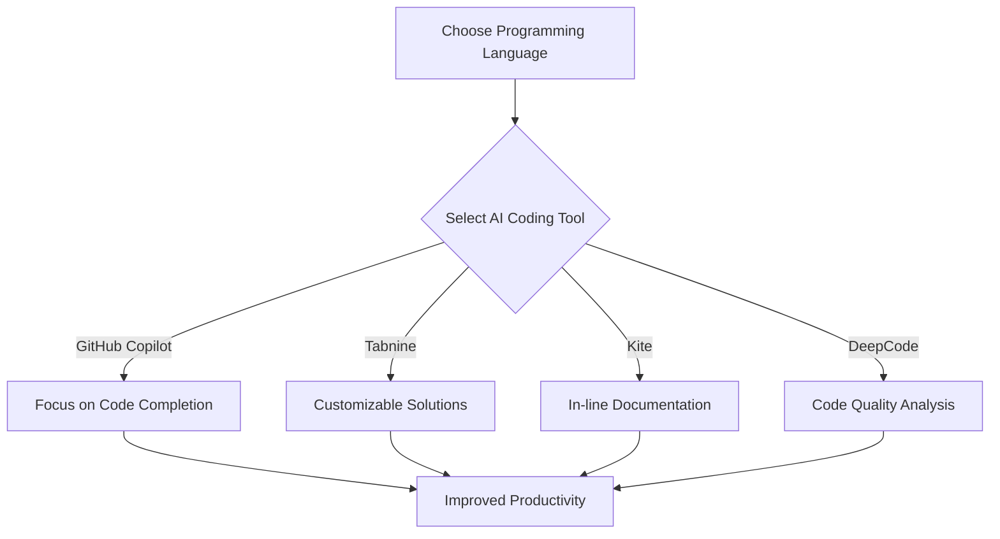

---

# Top AI Coding Tools to Boost Developer Productivity

In the fast-evolving world of software development, staying ahead of the curve is paramount. With the advent of artificial intelligence (AI), developers now have an arsenal of tools designed to enhance productivity, streamline workflows, and improve code quality. In this blog post, we'll explore some of the most effective AI coding tools available today, discussing their features, pros, cons, and practical use cases. Whether you're a seasoned developer or just starting, leveraging these AI tools can significantly boost your productivity.

## Why Use AI Coding Tools?

AI coding tools are designed to assist developers with various tasks, from code generation to debugging and documentation. By automating repetitive processes and providing smart suggestions, these tools can help developers focus on more complex problems, ultimately speeding up the development cycle and improving the quality of the code produced.

### Benefits of AI Coding Tools
- **Increased Efficiency**: Automate repetitive tasks and reduce time spent on mundane coding activities.
- **Enhanced Code Quality**: AI tools can identify errors and suggest improvements, leading to cleaner and more efficient code.
- **Learning Opportunities**: These tools can serve as educational resources, helping developers learn new programming languages or frameworks.

## Top AI Coding Tools to Consider

Let’s delve into some of the best AI coding tools currently available and how they can elevate your programming experience.

### 1. GitHub Copilot

**Overview**: [GitHub Copilot](https://github.com/features/copilot?ref=AFFILIATE_ID), developed by GitHub and OpenAI, is a powerful AI-powered code completion tool that suggests entire lines or blocks of code as you type.

**Pros**:
- Generates code snippets based on comments and existing code.
- Supports multiple programming languages.
- Integrated directly into popular IDEs like Visual Studio Code.

**Cons**:
- May sometimes produce incorrect or insecure code.
- Requires an active internet connection for optimal functionality.

**Use Case**: Suppose you're developing a web application using React. By typing out comments like `// create a button component`, GitHub [Copilot](https://github.com/features/copilot?ref=AFFILIATE_ID) can automatically generate the necessary code, allowing you to focus on other features.

### 2. Tabnine

**Overview**: [Tabnine](https://www.tabnine.com/?ref=AFFILIATE_ID) is an AI-driven code completion tool that integrates with numerous IDEs and editors, offering suggestions based on the context of the code you're writing.

**Pros**:
- Customizable AI model trained on your personal codebase.
- Supports multiple languages and frameworks.
- Offline functionality available with the Pro version.

**Cons**:
- The free version has limited features compared to Pro.
- Some users report that suggestions can be repetitive.

**Use Case**: While building a Python application, Tabnine can predict the next lines of code based on your coding patterns, significantly speeding up the coding process.

### 3. Kite

**Overview**: Kite is an AI-powered coding assistant that offers line-of-code completions and documentation for Python, JavaScript, and more.

**Pros**:
- Provides documentation and examples as you code.
- Supports over 16 languages.
- Works offline for improved convenience.

**Cons**:
- Limited to specific programming languages.
- Requires setup and configuration for optimal use.

**Use Case**: If you're writing a machine learning model in Python, Kite can provide in-line documentation for libraries like TensorFlow, helping you understand the functions without leaving your IDE.

### 4. DeepCode

**Overview**: DeepCode uses AI to analyze your code repository and provide real-time feedback on potential bugs, vulnerabilities, and code quality.

**Pros**:
- Deep analysis of code for security vulnerabilities.
- Integrates seamlessly with GitHub and Bitbucket.
- Offers suggestions for fixing issues.

**Cons**:
- May require a learning curve to understand its suggestions.
- Limited language support compared to other tools.

**Use Case**: If you're working on a large codebase, DeepCode can help you identify security vulnerabilities before they become a problem, ensuring your application remains secure.

## Comparison of AI Coding Tools

To help you make an informed decision, here’s a quick comparison of the AI coding tools mentioned above:

<table>
  <tr>
    <th>Tool</th>
    <th>Languages Supported</th>
    <th>IDE Integration</th>
    <th>Offline Access</th>
    <th>Pricing</th>
  </tr>
  <tr>
    <td>GitHub Copilot</td>
    <td>Multiple</td>
    <td>Visual Studio Code, JetBrains</td>
    <td>No</td>
    <td>Subscription-based</td>
  </tr>
  <tr>
    <td>Tabnine</td>
    <td>Multiple</td>
    <td>Various IDEs</td>
    <td>Yes (Pro Version)</td>
    <td>Free/Paid</td>
  </tr>
  <tr>
    <td>Kite</td>
    <td>Python, JavaScript, etc.</td>
    <td>Multiple</td>
    <td>Yes</td>
    <td>Free/Paid</td>
  </tr>
  <tr>
    <td>DeepCode</td>
    <td>Java, JavaScript, etc.</td>
    <td>GitHub, Bitbucket</td>
    <td>No</td>
    <td>Free/Paid</td>
  </tr>
</table>

## Choosing the Right AI Coding Tool

When selecting the right AI coding tool for your needs, consider the following factors:

- **Programming Language**: Ensure the tool supports the languages you're working with.
- **Integration**: Look for tools that integrate seamlessly with your existing IDEs and workflows.
- **Pricing**: Assess your budget and the value each tool provides based on its features.

## Conclusion

AI coding tools are revolutionizing the way developers work by providing intelligent solutions that enhance productivity and code quality. Whether you need real-time code suggestions, documentation support, or comprehensive code analysis, there's a tool tailored to your needs. 

So, why wait? Start exploring these AI coding tools today to unlock your full coding potential and streamline your development process. If you’re ready to take your coding skills to the next level, try out GitHub Copilot, Tabnine, Kite, or DeepCode and experience the difference AI can make in your workflow!

**Call to Action**: Have you tried any AI coding tools yet? Share your experiences in the comments below, or let us know which tools you’re excited to use!

## 関連記事

- [AI Coding Tools: Boosting Developer Efficiency in 2026](/posts/ai-coding-tools-boosting-developer-efficiency-in-2026/)
- [Revolutionizing Coding with AI: Top Tools for Developers](/posts/revolutionizing-coding-with-ai-top-tools-for-developers/)
- [Top AI Coding Tools Revolutionizing Developer Productivity](/posts/top-ai-coding-tools-revolutionizing-developer-productivity/)
