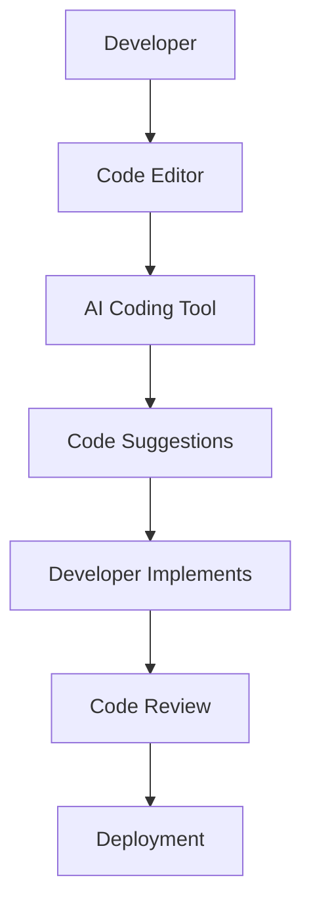

---

# Top AI Coding Tools to Enhance Developer Efficiency

In the fast-paced world of software development, efficiency is key. Developers are constantly under pressure to write clean code, manage projects, and meet deadlines. Fortunately, AI coding tools have emerged as a game-changer, providing innovative solutions that enhance productivity and streamline coding processes. In this article, we’ll explore the top AI coding tools available today, their unique features, pros and cons, and how they can help you elevate your coding game.

## What Are AI Coding Tools?

AI coding tools leverage artificial intelligence to assist developers in various aspects of coding, from generating code to debugging and optimizing performance. They can help automate repetitive tasks, suggest code snippets, and even learn from your coding style to provide personalized recommendations. By integrating these tools into your workflow, you can significantly reduce development time and improve code quality.

## Why Use AI Coding Tools?

Using AI coding tools offers several benefits:

1. **Increased Efficiency**: Automate mundane tasks and let AI handle repetitive coding.
2. **Improved Code Quality**: AI tools often have built-in code analysis features that can detect bugs and suggest improvements.
3. **Learn and Adapt**: Many AI tools learn from your coding habits, adapting to your style and improving their suggestions over time.
4. **Collaboration**: AI tools can aid in collaborative coding environments, ensuring that team members are on the same page with code standards and practices.

## Top AI Coding Tools

Let’s dive into some of the top AI coding tools that can enhance your development efficiency.

### 1. GitHub Copilot

[GitHub Copilot](https://github.com/features/copilot?ref=AFFILIATE_ID), developed by GitHub in collaboration with OpenAI, is one of the most popular AI coding tools available. It acts as an AI pair programmer that suggests code snippets in real-time as you type.

#### Features:
- Context-aware code suggestions
- Supports multiple programming languages
- Integrates seamlessly with Visual Studio Code

#### Pros:
- Saves time by generating code based on comments
- Improves coding speed and efficiency
- Learns from your coding style over time

#### Cons:
- Suggestions may not always be accurate
- Requires an internet connection
- Some users may find it overwhelming if not used properly

### 2. Tabnine

[Tabnine](https://www.tabnine.com/?ref=AFFILIATE_ID) is another powerful AI coding assistant that uses machine learning to provide code completions and suggestions in real-time. It supports various IDEs and programming languages.

#### Features:
- Predictive code completions
- Code quality checks
- Team training feature for consistent code style

#### Pros:
- Highly customizable
- Works offline with local models
- Supports a wide range of programming languages

#### Cons:
- The free version has limited features
- Can be resource-intensive on lower-end machines

### 3. Kite

Kite is an AI-powered coding assistant that offers code completions, documentation, and examples right within your IDE. It's designed to improve productivity for Python and JavaScript developers.

#### Features:
- Intelligent code completions
- Instant documentation lookup
- Multi-language support

#### Pros:
- Easy to install and set up
- Comprehensive documentation support
- Free version available with core features

#### Cons:
- Limited to specific programming languages
- Some advanced features require a paid subscription

### 4. Codex by OpenAI

OpenAI's Codex is the underlying technology behind GitHub [Copilot](https://github.com/features/copilot?ref=AFFILIATE_ID), providing a sophisticated natural language processing engine for coding tasks. It can generate code from simple English commands.

#### Features:
- Translates natural language to code
- Can autocomplete entire functions
- Supports many programming languages

#### Pros:
- Extremely versatile in generating code
- Excellent for beginners to learn programming concepts
- Can help in generating code for complex algorithms

#### Cons:
- Might generate inefficient or insecure code
- Requires careful review of generated code
- Access is currently limited for individual developers

### Comparison of AI Coding Tools

Here’s a summary comparison of these AI coding tools to help you make an informed decision:

<table>
    <tr>
        <th>Tool</th>
        <th>Supported Languages</th>
        <th>Integration</th>
        <th>Pricing</th>
    </tr>
    <tr>
        <td>[GitHub Copilot](https://github.com/features/copilot?ref=AFFILIATE_ID)</td>
        <td>Multiple</td>
        <td>Visual Studio Code</td>
        <td>Subscription-based</td>
    </tr>
    <tr>
        <td>[Tabnine](https://www.tabnine.com/?ref=AFFILIATE_ID)</td>
        <td>Multiple</td>
        <td>Various IDEs</td>
        <td>Free/Paid</td>
    </tr>
    <tr>
        <td>Kite</td>
        <td>Python, JavaScript</td>
        <td>Various IDEs</td>
        <td>Free/Paid</td>
    </tr>
    <tr>
        <td>Codex</td>
        <td>Multiple</td>
        <td>API Integration</td>
        <td>Usage-based</td>
    </tr>
</table>

## Workflow of Using AI Coding Tools

To visualize how these tools can integrate into your development workflow, here’s a simple diagram:

## Choosing the Right AI Coding Tool

When selecting an AI coding tool, consider the following factors:

1. **Programming Language**: Ensure the tool supports the languages you work with.
2. **Integration**: Check compatibility with your existing IDE or text editor.
3. **Features**: Assess which features are most beneficial for your workflow.
4. **Budget**: Determine if a free version suffices or if you need premium features.

## Conclusion

AI coding tools are revolutionizing the way developers write and manage code. By integrating tools like GitHub [Copilot](https://github.com/features/copilot?ref=AFFILIATE_ID), [Tabnine](https://www.tabnine.com/?ref=AFFILIATE_ID), Kite, or OpenAI’s Codex into your workflow, you can enhance your productivity, improve code quality, and streamline your projects. 

Now is the perfect time to explore these tools and see how they can benefit your coding experience. Don’t miss out—try them out today and take your development efficiency to the next level!

### Call to Action

Ready to supercharge your coding productivity? Start with a trial of one of these AI coding tools today and transform the way you code! Share your experiences or any other AI coding tools you love in the comments below!

## 関連記事

- [AI Pair Programming: How Coding Assistants Are Replacing Rubber Ducks](/posts/ai-coding-tools-revolutionizing-software-development/)
- [Shipping Faster: AI Tools That Cut Development Time in Half](/posts/ai-coding-tools-the-key-to-faster-development-cycles/)
- [AI Coding Tools for Beginners: Where to Start in 2026](/posts/how-ai-coding-tools-are-revolutionizing-software-development/)
