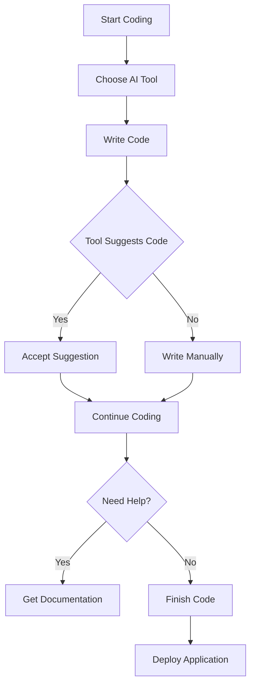

---

# Top AI Coding Tools Transforming Software Development

In the fast-paced world of software development, the integration of artificial intelligence (AI) has become a game changer. AI coding tools are not just a trend; they are transforming how developers code, troubleshoot, and collaborate. From automating mundane tasks to enhancing code quality, these tools are paving the way for a more efficient coding environment. Let’s dive into the top AI coding tools that are reshaping the development landscape.

## What Are AI Coding Tools?

AI coding tools leverage machine learning algorithms to assist developers in various stages of the software development lifecycle. They can help with code completion, error detection, generating documentation, and even providing suggestions for improving code structure. By automating routine tasks, these tools allow developers to focus on more complex challenges, ultimately speeding up the development process.

## Key Benefits of Using AI Coding Tools

Before we explore specific tools, let's outline some of the key benefits they offer:

- **Increased Productivity**: Automating repetitive tasks allows developers to focus on creative problem-solving.
- **Enhanced Code Quality**: AI can identify potential bugs and suggest best practices, leading to cleaner, more maintainable code.
- **Faster Learning Curve**: New developers can learn from AI suggestions, accelerating their understanding of programming languages and frameworks.
- **Collaboration Facilitation**: AI tools can help teams work together more effectively by streamlining communication and documentation.

## Top AI Coding Tools in 2023

### 1. GitHub Copilot

GitHub Copilot is an AI-powered code completion tool designed to assist developers by suggesting entire lines or blocks of code as they type. It uses OpenAI's Codex model to understand the context of the code being written.

#### Pros:
- Context-aware suggestions enhance coding efficiency.
- Supports multiple programming languages.
- Integrated within popular IDEs like Visual Studio Code.

#### Cons:
- May produce incorrect or insecure code suggestions.
- Dependency on internet connectivity for optimal performance.

### 2. Tabnine

Tabnine is another AI coding assistant that provides code completions based on deep learning models trained on open-source code. It can be integrated into various IDEs and supports multiple programming languages.

#### Pros:
- Fast and reliable code completions.
- Works offline, providing flexibility.
- Highly customizable according to coding style.

#### Cons:
- The free version has limited features.
- Performance can vary based on language and context.

### 3. Kite

Kite is an AI-powered coding assistant that helps developers write code faster by providing intelligent code completions and documentation. It integrates seamlessly with common code editors.

#### Pros:
- Supports over 16 languages and frameworks.
- In-line documentation helps developers understand functions quickly.
- Offers a Copilot feature for suggestions based on comments.

#### Cons:
- Limited support for some niche programming languages.
- Requires installation of additional plugins for full functionality.

### 4. Sourcery

Sourcery stands out by focusing on code quality. It analyzes Python code and provides suggestions for refactoring and improving code structure.

#### Pros:
- Specializes in Python, making it ideal for Python developers.
- Provides actionable insights for code improvement.
- Integrates with GitHub and CI/CD pipelines.

#### Cons:
- Limited to Python, which may not suit all developers.
- Some features are premium.

### 5. CodeGuru

Amazon CodeGuru is a developer tool that uses machine learning to identify code issues and suggest improvements. It works for Java and Python applications primarily hosted on AWS.

#### Pros:
- Integrates well with AWS services.
- Provides insightful reviews and recommendations.
- Helps with cost optimization of applications.

#### Cons:
- Best suited for AWS environments, limiting its use for other platforms.
- Pricing can add up based on usage.

## Comparing AI Coding Tools

When selecting the right AI coding tool for your needs, it’s helpful to compare their features, strengths, and weaknesses. Here’s a quick comparison table to guide your decision:

<table>
  <tr>
    <th>Tool</th>
    <th>Best For</th>
    <th>Main Features</th>
    <th>Pros</th>
    <th>Cons</th>
  </tr>
  <tr>
    <td>GitHub Copilot</td>
    <td>General coding assistance</td>
    <td>Code suggestions, multi-language support</td>
    <td>Context-aware, IDE integration</td>
    <td>Occasional inaccuracies</td>
  </tr>
  <tr>
    <td>Tabnine</td>
    <td>Customizable coding</td>
    <td>Deep learning code completions</td>
    <td>Offline capability, customizable</td>
    <td>Limited free features</td>
  </tr>
  <tr>
    <td>Kite</td>
    <td>Documentation and code completion</td>
    <td>In-line documentation, multi-language support</td>
    <td>Fast, helpful for learning</td>
    <td>Limited niche language support</td>
  </tr>
  <tr>
    <td>Sourcery</td>
    <td>Python code quality improvement</td>
    <td>Refactoring suggestions</td>
    <td>Actionable insights</td>
    <td>Python only</td>
  </tr>
  <tr>
    <td>CodeGuru</td>
    <td>AWS application optimization</td>
    <td>Code reviews, performance recommendations</td>
    <td>Deep integration with AWS</td>
    <td>Costly for extensive use</td>
  </tr>
</table>

## Workflow of AI Coding Tools

Understanding how these tools fit into your development workflow can clarify their utility. Here’s a simple workflow illustration:

In this workflow, the AI coding tool fits seamlessly into the coding process, helping developers at every step.

## Conclusion

AI coding tools have revolutionized how we approach software development. By automating repetitive tasks, assisting in code quality improvement, and providing real-time suggestions, these tools significantly enhance productivity and code reliability. Whether you are a beginner looking to learn or an experienced developer seeking to optimize your workflow, there’s an AI coding tool for everyone.

As the tech landscape continues to evolve, staying updated with the latest tools can give you a competitive edge. So why wait? Explore these AI coding tools today, and transform your coding experience for the better!

### Call to Action

Ready to enhance your coding experience? Try out one of these AI coding tools today and see how they can boost your productivity and code quality! Share your experiences in the comments below or reach out to us for more insights on AI tools shaping the future of software development.