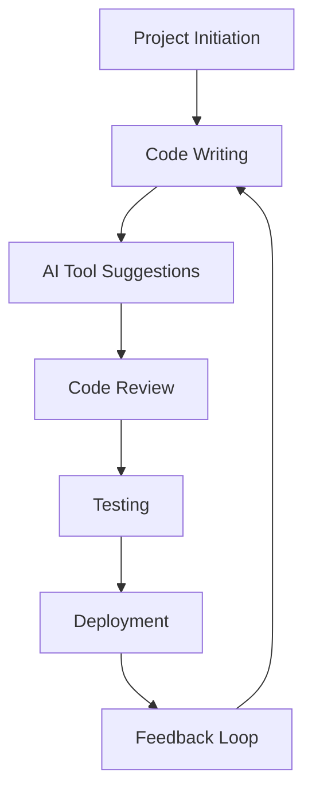

---

## Top AI Coding Tools Transforming Software Development

Welcome to the new era of coding! The world of software development is evolving rapidly, and at the forefront of this transformation are AI coding tools. These innovative solutions are designed to boost productivity, streamline workflows, and even assist in code generation. In this blog post, we'll explore some of the top AI coding tools that are making waves in the software development landscape, along with their features, pros, cons, and practical use cases.

### What are AI Coding Tools?

AI coding tools leverage artificial intelligence and machine learning algorithms to assist developers in various aspects of coding. From writing and debugging code to providing suggestions and automating repetitive tasks, these tools are designed to enhance the coding experience. By integrating AI into the development process, developers can save time, reduce errors, and focus on higher-level tasks that require creativity and problem-solving skills.

### Why Use AI Coding Tools?

The adoption of AI coding tools can significantly impact a development team's efficiency and output. Here are a few reasons why developers are embracing these tools:

- **Increased Productivity:** AI coding tools can automate mundane tasks, allowing developers to focus on more complex aspects of their projects.
- **Enhanced Code Quality:** With real-time suggestions and error detection, developers can produce cleaner and more efficient code.
- **Faster Development Cycles:** AI can help speed up the development process by suggesting code snippets and automating testing.

### Top AI Coding Tools to Consider

Let's delve into some of the most popular AI coding tools that are transforming the software development landscape.

#### 1. GitHub Copilot

**Overview:** [GitHub Copilot](https://github.com/features/copilot?ref=AFFILIATE_ID) is an AI-powered code completion tool developed by GitHub in collaboration with OpenAI. It assists developers by suggesting code snippets based on the context of what they are writing.

**Pros:**
- Provides real-time code suggestions.
- Supports multiple programming languages.
- Integrates seamlessly with popular IDEs like Visual Studio Code.

**Cons:**
- May suggest incorrect or insecure code.
- Requires an internet connection to function effectively.

**Use Case:** A developer working on a complex Python project can use GitHub [Copilot](https://github.com/features/copilot?ref=AFFILIATE_ID) to receive suggestions for functions or libraries they might need, speeding up the coding process significantly.

#### 2. Tabnine

**Overview:** [Tabnine](https://www.tabnine.com/?ref=AFFILIATE_ID) is an AI-driven autocompletion tool that learns from your coding style to provide personalized code suggestions.

**Pros:**
- Customizable based on individual coding habits.
- Supports over 30 programming languages.
- Works offline with local models.

**Cons:**
- The free version has limited features.
- May require time to learn and adapt to personal coding styles.

**Use Case:** A software engineer developing a web application can utilize Tabnine to improve their coding speed by receiving tailored suggestions as they type.

#### 3. DeepCode

**Overview:** DeepCode uses AI to analyze code and provide suggestions for improvements and potential bugs.

**Pros:**
- Advanced code review capabilities.
- Integrates with version control systems.
- Provides insights into code quality and security.

**Cons:**
- Requires setup and configuration.
- Can provide recommendations that might not always align with the team's coding standards.

**Use Case:** A team of developers can use DeepCode to perform code reviews before merging changes, ensuring that code quality is maintained across the project.

#### 4. Sourcery

**Overview:** Sourcery is an AI tool that focuses on improving existing codebases by suggesting refactorings to enhance readability and performance.

**Pros:**
- Helps maintain clean code.
- Offers suggestions for refactoring and optimization.
- Integrates with various IDEs.

**Cons:**
- Limited to Python projects.
- May require manual review of suggestions.

**Use Case:** A Python developer can use Sourcery to optimize their code structure, improving maintainability and performance.

### Comparison of AI Coding Tools

To help you understand the differences between these AI coding tools, here's a comparison table that highlights their key features:

<table>
  <tr>
    <th>Tool</th>
    <th>Real-time Suggestions</th>
    <th>Language Support</th>
    <th>Offline Functionality</th>
    <th>Integration</th>
  </tr>
  <tr>
    <td>GitHub Copilot</td>
    <td>Yes</td>
    <td>Multiple</td>
    <td>No</td>
    <td>Visual Studio Code</td>
  </tr>
  <tr>
    <td>Tabnine</td>
    <td>Yes</td>
    <td>30+</td>
    <td>Yes</td>
    <td>Multiple IDEs</td>
  </tr>
  <tr>
    <td>DeepCode</td>
    <td>No</td>
    <td>Java, JavaScript, Python</td>
    <td>No</td>
    <td>Version Control Systems</td>
  </tr>
  <tr>
    <td>Sourcery</td>
    <td>No</td>
    <td>Python</td>
    <td>No</td>
    <td>Multiple IDEs</td>
  </tr>
</table>

### Workflow of AI Coding Tools

To visualize the integration of AI coding tools into the development workflow, here's a simple diagram:

### Conclusion

The rise of AI coding tools is reshaping the landscape of software development, offering immense benefits in terms of productivity, code quality, and collaboration. Whether you're a novice developer or an experienced software engineer, integrating these tools into your workflow can create a more efficient coding environment.

As you explore the options available, consider your specific needs, the programming languages you work with, and the type of projects you undertake. By embracing the power of AI coding tools, you can unlock new levels of productivity and creativity in your development process.

### Call to Action

Are you ready to transform your coding experience? Start exploring these AI coding tools today and see how they can enhance your software development process. Share your experiences and favorite tools in the comments below!

## 関連記事

- [AI Coding Tools: Boosting Developer Efficiency in 2026](/posts/ai-coding-tools-boosting-developer-efficiency-in-2026/)
- [How AI Coding Tools are Revolutionizing Software Development](/posts/how-ai-coding-tools-are-revolutionizing-software-development/)
- [How AI Coding Tools Boost Developer Efficiency in 2026](/posts/how-ai-coding-tools-boost-developer-efficiency-in-2026/)
