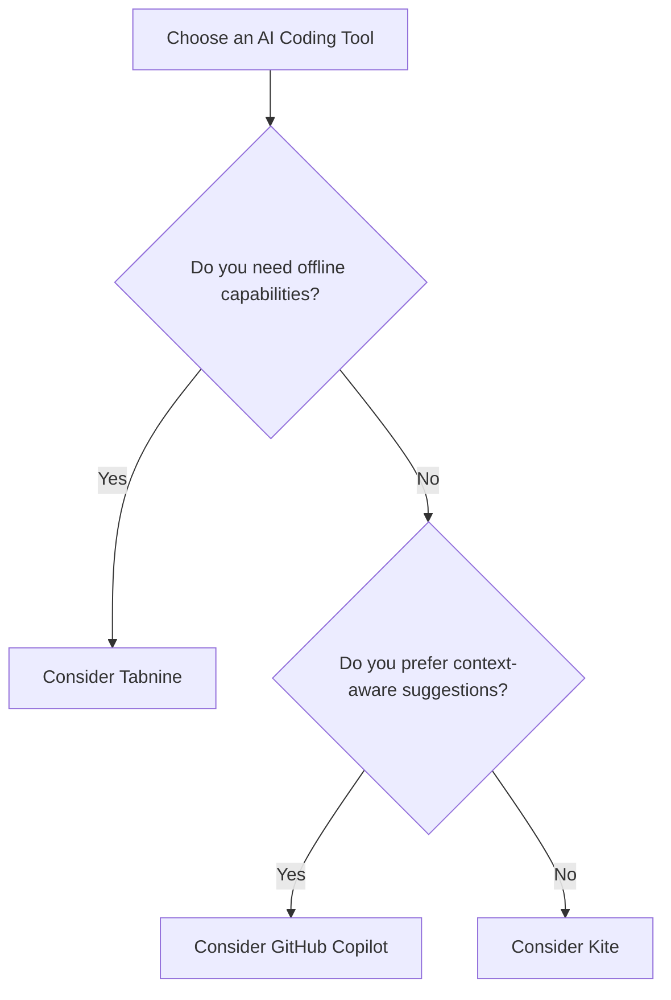

## Top AI Coding Tools Transforming Software Development

In the fast-paced world of software development, staying ahead of the curve is essential. With the rise of artificial intelligence, developers are now equipped with powerful AI coding tools that not only enhance productivity but also streamline workflows. These tools are revolutionizing how we write, debug, and maintain code. Whether you’re a seasoned developer or a beginner, understanding these tools can significantly impact your coding experience. Let's dive into the top AI coding tools that are transforming the landscape of software development.

### What Are AI Coding Tools?

AI coding tools leverage machine learning, natural language processing, and other AI technologies to assist developers in various aspects of coding. These tools can help with generating code snippets, debugging errors, and even predicting the next line of code. By automating mundane tasks, AI coding tools free developers to focus on more complex problem-solving and creative tasks.

### Why Use AI Coding Tools?

The adoption of AI coding tools can lead to increased productivity, fewer errors, and faster development cycles. Here are some compelling reasons to consider incorporating these tools into your workflow:

- **Enhanced Efficiency**: Automate repetitive coding tasks and reduce the time spent on debugging.
- **Improved Code Quality**: AI tools can suggest best practices and catch potential errors before they become problems.
- **Learning Opportunities**: These tools can help new developers learn coding conventions and best practices.
  
### Top AI Coding Tools

Let’s explore some of the leading AI coding tools available today and how they can transform your software development process.

#### 1. GitHub Copilot

**Overview**: GitHub Copilot is an AI pair programmer that suggests whole lines or blocks of code as you type. Built on OpenAI's Codex, it understands context and can recommend code snippets in various programming languages.

**Use Cases**:
- **Code Suggestions**: As you write code, Copilot provides suggestions, allowing for faster coding.
- **Learning Tool**: New developers can learn coding patterns by observing suggestions.

**Pros**:
- Context-aware suggestions.
- Supports multiple programming languages.
- Continuous improvement through user feedback.

**Cons**:
- May suggest incorrect or insecure code.
- Requires internet connectivity.

#### 2. Tabnine

**Overview**: Tabnine uses deep learning to provide AI-driven code completions. It integrates with popular IDEs and can learn from your coding style to offer personalized suggestions.

**Use Cases**:
- **Custom Code Completions**: Tailors suggestions based on your project code and style.
- **Team Collaboration**: Offers suggestions that align with team coding standards.

**Pros**:
- Works offline with a local model.
- Highly customizable.
- Fast and responsive.

**Cons**:
- Limited support for some programming languages compared to others.
- Can be overwhelming for beginners due to numerous settings.

#### 3. Kite

**Overview**: Kite is another AI-powered coding assistant that helps developers write code faster. It offers line-of-code completions and documentation snippets right in your IDE.

**Use Cases**:
- **Documentation Retrieval**: Quickly access function documentation while coding.
- **Code Snippets**: Generate entire functions based on comments.

**Pros**:
- Excellent support for Python and JavaScript.
- Integrates seamlessly with various IDEs.
- Offers a "Kite Copilot" for in-depth completions.

**Cons**:
- Limited language support compared to competitors.
- Some features may require a paid subscription.

### Comparison of Top AI Coding Tools

Here's a quick comparison of the three AI coding tools we've discussed:

<table>
    <tr>
        <th>Feature</th>
        <th>GitHub Copilot</th>
        <th>Tabnine</th>
        <th>Kite</th>
    </tr>
    <tr>
        <td>Context-Aware Suggestions</td>
        <td>Yes</td>
        <td>Yes</td>
        <td>Moderate</td>
    </tr>
    <tr>
        <td>Offline Capabilities</td>
        <td>No</td>
        <td>Yes</td>
        <td>Yes (Limited)</td>
    </tr>
    <tr>
        <td>IDE Compatibility</td>
        <td>Visual Studio Code, JetBrains</td>
        <td>Multiple IDEs</td>
        <td>Multiple IDEs</td>
    </tr>
    <tr>
        <td>Learning Capabilities</td>
        <td>Yes</td>
        <td>Yes</td>
        <td>Moderate</td>
    </tr>
    <tr>
        <td>Price</td>
        <td>Subscription-based</td>
        <td>Free / Paid</td>
        <td>Free / Paid</td>
    </tr>
</table>

### How to Choose the Right AI Coding Tool

With so many options available, choosing the right AI coding tool for your needs can be daunting. Here’s a simple decision tree to help guide your choice:

### Final Thoughts

AI coding tools are transforming the software development landscape, making coding more accessible, efficient, and enjoyable. By integrating these tools into your workflow, you can enhance your productivity, improve code quality, and even learn new skills. 

So why wait? Experiment with these AI coding tools today and see how they can elevate your development experience. Whether you choose GitHub Copilot, Tabnine, or Kite, you're bound to find significant improvements in your coding journey.

### Call to Action

Ready to supercharge your coding? Try out one of these AI coding tools today and experience the transformative power of AI in software development. Share your thoughts or experiences in the comments below, and let’s discuss how AI is shaping the future of coding!