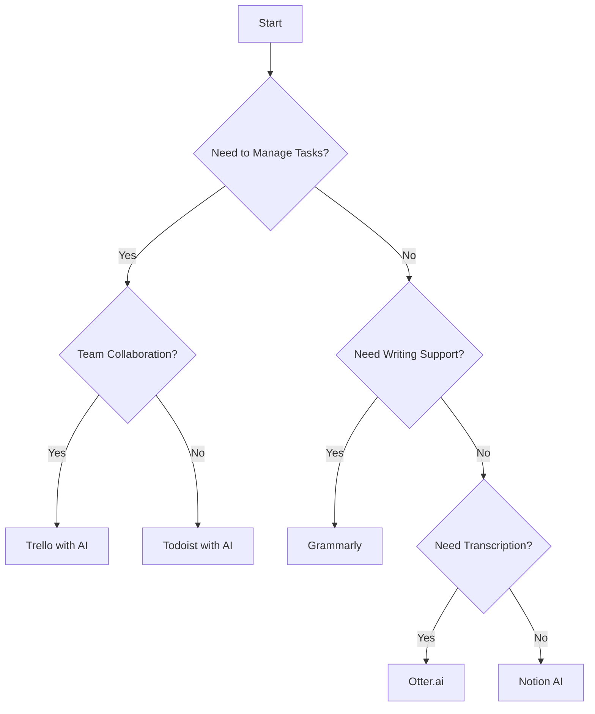

---

# Top AI Tools to Boost Your Productivity in 2026

As we venture further into 2026, the landscape of productivity is evolving rapidly, thanks to advancements in artificial intelligence. The integration of AI productivity tools is transforming how we work, making tasks easier, faster, and more efficient. In this article, we’ll explore the top AI productivity tools available this year, discussing their features, pros and cons, and practical use cases to help you skyrocket your productivity.

## Why AI Productivity Tools Matter

AI productivity tools are designed to automate routine tasks, streamline workflows, and enhance decision-making processes. With the ability to analyze data, predict trends, and learn from user behavior, these tools can significantly improve efficiency and effectiveness in both personal and professional settings. 

Let’s dive into the top AI productivity tools of 2026 and see how they can benefit you.

## 1. Notion AI

### Overview

[Notion AI](https://www.notion.so/product/ai?ref=AFFILIATE_ID) is a groundbreaking extension of the popular productivity platform, Notion. It combines note-taking, project management, and database functionalities with powerful AI capabilities.

### Features

- **Content Generation**: Generate text for notes, emails, and reports with an AI writing assistant.
- **Task Automation**: Automate repetitive tasks and reminders based on your workflow.
- **Integrated Collaboration**: Collaborate in real-time with team members, with AI suggesting improvements and edits.

### Pros and Cons

| Pros                          | Cons                           |
|-------------------------------|--------------------------------|
| Highly customizable interface  | Can be overwhelming for new users |
| Excellent collaboration features| Limited third-party integrations |

### Use Case

Imagine you’re a project manager leading a team. With [Notion AI](https://www.notion.so/product/ai?ref=AFFILIATE_ID), you can create a project timeline, generate updates automatically, and collaborate with your team—all in one platform. 

## 2. Trello with AI Integration

### Overview

Trello has always been a go-to tool for project management. Its recent AI integration enhances its functionality by providing smart suggestions and automating workflows.

### Features

- **Smart Suggestions**: Get recommendations for task assignments based on team members’ workload.
- **Automated Card Management**: Automatically move cards between lists based on deadlines and priorities.
- **Insights and Analytics**: Use AI to analyze project performance and suggest improvements.

### Pros and Cons

| Pros                           | Cons                              |
|--------------------------------|-----------------------------------|
| User-friendly interface        | Limited features without AI      |
| Excellent for team collaboration| May require a learning curve for AI features |

### Use Case

Suppose you’re managing a marketing campaign. Trello with AI integration can help assign tasks to team members based on their availability and past performance, making the process smoother and more efficient.

## 3. Otter.ai

### Overview

[Otter.ai](https://otter.ai/?ref=AFFILIATE_ID) is an AI-powered transcription tool that helps users convert speech to text in real time. It’s perfect for meetings, interviews, and lectures.

### Features

- **Real-Time Transcription**: Capture conversations as they happen.
- **Highlight Key Points**: Automatically identify and highlight important moments in discussions.
- **Integration with Other Tools**: Works seamlessly with Zoom, Google Meet, and more.

### Pros and Cons

| Pros                           | Cons                                   |
|--------------------------------|----------------------------------------|
| Accurate transcriptions        | Requires internet connection            |
| Essential for remote meetings   | Can struggle with heavy accents        |

### Use Case

Imagine you’re attending a crucial business meeting. With [Otter.ai](https://otter.ai/?ref=AFFILIATE_ID), you can focus on the discussion while the tool captures everything in real-time, allowing you to review and share the notes later.

## 4. Todoist with AI Assistant

### Overview

Todoist is a task management tool that has integrated an AI assistant to help users prioritize and manage their tasks effectively.

### Features

- **Task Prioritization**: Automatically rank tasks based on deadlines and user-defined goals.
- **Progress Tracking**: Monitor your productivity trends over time.
- **Smart Scheduling**: Get suggestions for the best times to complete tasks.

### Pros and Cons

| Pros                           | Cons                                   |
|--------------------------------|----------------------------------------|
| Intuitive design               | Limited features in the free version   |
| Cross-platform availability     | AI suggestions can be generic         |

### Use Case

If you're a freelancer juggling multiple projects, Todoist’s AI assistant can help you prioritize tasks based on deadlines and project importance, ensuring you never miss a deadline.

## 5. Grammarly

### Overview

[Grammarly](https://www.grammarly.com/?ref=AFFILIATE_ID) is well-known for its AI-powered writing assistance, but its productivity features have grown significantly, making it an essential tool for professionals.

### Features

- **Real-Time Grammar Checking**: Catch errors and receive suggestions as you write.
- **Tone Adjustment**: Adjust your writing style based on the intended audience.
- **Plagiarism Detection**: Ensure originality in your content.

### Pros and Cons

| Pros                           | Cons                                      |
|--------------------------------|-------------------------------------------|
| Enhances writing quality       | May require a subscription for full features |
| Works across multiple platforms | Can be overly suggestive at times       |

### Use Case

For writers and marketers, [Grammarly](https://www.grammarly.com/?ref=AFFILIATE_ID) can elevate your content quality by ensuring that your writing is clear, engaging, and free of errors, saving you time in the editing process.

## Comparing AI Productivity Tools

To make it easier for you to choose the right tool, here’s a comparison table of the features, pros, and cons discussed above:

<table>
    <tr>
        <th>Tool</th>
        <th>Key Features</th>
        <th>Pros</th>
        <th>Cons</th>
    </tr>
    <tr>
        <td>Notion AI</td>
        <td>Content generation, task automation, collaboration</td>
        <td>Customizable, excellent collaboration</td>
        <td>Overwhelming for beginners</td>
    </tr>
    <tr>
        <td>Trello with AI</td>
        <td>Smart suggestions, automated card management</td>
        <td>User-friendly, great for teamwork</td>
        <td>Learning curve for AI features</td>
    </tr>
    <tr>
        <td>Otter.ai</td>
        <td>Real-time transcription, highlight key points</td>
        <td>Accurate, essential for meetings</td>
        <td>Requires internet, struggles with accents</td>
    </tr>
    <tr>
        <td>Todoist with AI</td>
        <td>Task prioritization, smart scheduling</td>
        <td>Intuitive, cross-platform</td>
        <td>Limited free features</td>
    </tr>
    <tr>
        <td>Grammarly</td>
        <td>Grammar checking, tone adjustment</td>
        <td>Enhances writing quality, versatile</td>
        <td>Subscription needed for full features</td>
    </tr>
</table>

## Visualizing AI Workflow

To help you understand how these tools can be integrated into your daily workflow, here’s a simple decision tree illustrating how to choose the right AI productivity tool based on your needs.

## Conclusion

AI productivity tools are no longer just a trend—they're essential for anyone looking to enhance their efficiency and effectiveness in 2026. Whether you need help managing tasks, improving writing, or transcribing meetings, there's an AI tool tailored for your needs.

Don’t let outdated methods slow you down. Explore these AI productivity tools today and take your productivity to the next level. Which tool are you most excited to try? Share your thoughts in the comments below!

### Call to Action

Ready to boost your productivity? Start by exploring these AI tools and see which one fits your workflow best. Visit their official websites, sign up for trials, and experience the future of productivity today!

## 関連記事

- [AI-Driven Productivity: Tools Every Business Needs in 2026](/posts/ai-driven-productivity-tools-every-business-needs-in-2026/)
- [AI-Powered Productivity: Transforming Workflows](/posts/ai-powered-productivity-transforming-workflows/)
- [Top AI Tools Boosting Productivity in 2026](/posts/top-ai-tools-boosting-productivity-in-2026/)
