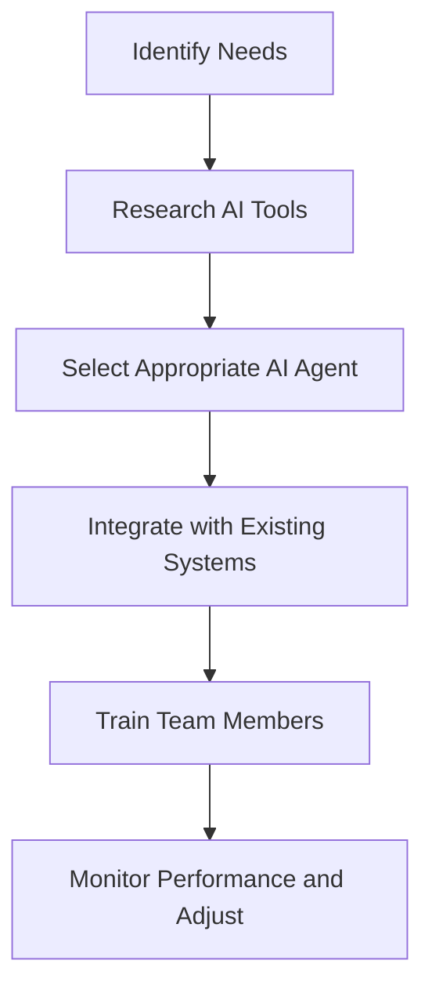

---

## Transforming Productivity with AI Agents in 2026

In the fast-evolving landscape of 2026, the integration of AI agents into our daily workflows is not just a trend; it's a necessity for staying competitive and efficient. As businesses and individuals strive to maximize productivity, AI agents have emerged as powerful allies, capable of automating tasks, enhancing decision-making, and optimizing time management. In this article, we’ll explore the transformative role of AI agents for productivity, practical examples of their applications, and a glimpse into the future of work.

### What Are AI Agents?

AI agents are software programs that leverage artificial intelligence to perform tasks autonomously or semi-autonomously. Unlike traditional software, which requires explicit instructions from users, AI agents can learn from data, adapt to changing conditions, and make decisions based on predefined criteria. This ability to operate independently makes them invaluable for enhancing productivity.

### How AI Agents Boost Productivity

AI agents enhance productivity by streamlining processes, reducing manual work, and providing insights that help users make informed decisions. Let's break down some key areas where AI agents are making a significant impact:

#### 1. Task Automation

One of the most immediate benefits of AI agents is their ability to automate repetitive tasks. For instance, AI agents can handle email sorting, calendar management, and data entry, freeing up valuable time for professionals to focus on more strategic activities.

**Example:** An AI agent like x.ai can schedule meetings by analyzing participants' availability and preferences, eliminating the back-and-forth email exchanges that usually accompany meeting setups.

#### 2. Enhanced Decision-Making

AI agents can analyze vast amounts of data quickly, providing insights that help users make better decisions. This is particularly useful in industries such as finance, healthcare, and marketing, where timely decisions are crucial.

**Example:** In marketing, AI agents like HubSpot's AI tools can analyze customer behavior and suggest personalized content strategies, ultimately leading to higher engagement and conversion rates.

#### 3. Personalization and Customization

AI agents can tailor experiences based on user preferences and behaviors. By learning from interactions, they can provide personalized recommendations, improving user satisfaction and engagement.

**Example:** Virtual assistants like Google Assistant can understand user preferences over time, offering customized news updates, reminders, and recommendations based on individual habits.

### The Future of AI Agents for Productivity

As we look toward the future, the capabilities of AI agents are expected to expand significantly. Here are some trends that may shape the future of AI agents for productivity:

#### 1. Advanced Natural Language Processing (NLP)

Improvements in NLP will allow AI agents to understand and respond to human language more effectively. This will enhance their ability to assist in complex tasks, such as drafting reports or conducting market research.

#### 2. Integration with IoT Devices

AI agents are expected to work seamlessly with Internet of Things (IoT) devices, creating a more connected and efficient workspace. For instance, smart office systems could adjust lighting and climate based on employee preferences, managed by AI agents.

#### 3. Increased Collaboration

AI agents will facilitate collaboration among teams, allowing for real-time feedback and communication. Tools like Microsoft Teams and Slack are already incorporating AI features to enhance team dynamics.

### Pros and Cons of AI Agents for Productivity

While AI agents offer numerous benefits, there are also challenges to consider. Here’s a quick overview of the pros and cons:

| Pros                                        | Cons                                       |
|---------------------------------------------|--------------------------------------------|
| Increased efficiency through automation      | Potential job displacement                  |
| Enhanced data analysis for informed decisions| Dependence on technology                    |
| Personalized user experiences               | Privacy concerns over data usage            |
| Continuous learning and adaptation          | Initial setup and training requirements     |

### Comparison of Top AI Agents for Productivity

To help you choose the right AI agent for your needs, we’ve compiled a comparison of some of the leading tools in the market:

<table>
  <tr>
    <th>Tool</th>
    <th>Key Features</th>
    <th>Best For</th>
    <th>Pricing</th>
  </tr>
  <tr>
    <td>x.ai</td>
    <td>Meeting scheduling, calendar management</td>
    <td>Busy professionals</td>
    <td>$8/month</td>
  </tr>
  <tr>
    <td>HubSpot AI</td>
    <td>Marketing insights, content recommendations</td>
    <td>Marketing teams</td>
    <td>Free with limited features</td>
  </tr>
  <tr>
    <td>Google Assistant</td>
    <td>Voice commands, task reminders</td>
    <td>Everyday users</td>
    <td>Free</td>
  </tr>
  <tr>
    <td>Zapier</td>
    <td>Workflow automation, app integration</td>
    <td>Small businesses</td>
    <td>$20/month</td>
  </tr>
</table>

### Workflow of Implementing AI Agents in Your Productivity Strategy

To effectively integrate AI agents into your productivity strategy, consider the following workflow:

### Conclusion

AI agents for productivity are reshaping how we work and manage our tasks in 2026. By automating repetitive tasks, enhancing decision-making, and personalizing experiences, these tools are paving the way for a more efficient and effective workplace. However, it’s essential to weigh the pros and cons and choose the right tools that fit your specific needs.

Are you ready to transform your productivity with AI agents? Start by exploring the tools mentioned in this article and take your first step towards a more efficient workflow today! 

### Call to Action

Don’t wait to embrace the future of productivity. Share your thoughts on AI agents in the comments below, and let us know which tools you’re excited to try! For more insights and updates on AI tools, subscribe to AI Tools Lab and stay ahead of the curve.

## 関連記事

- [AI Agents: The Future of Personal Assistants in 2026](/posts/ai-agents-the-future-of-personal-assistants-in-2026/)
- [AI Automation: A Game Changer for Small Businesses](/posts/ai-automation-a-game-changer-for-small-businesses/)
- [AI Automation: The Key to Enhanced Business Efficiency](/posts/ai-automation-the-key-to-enhanced-business-efficiency/)
