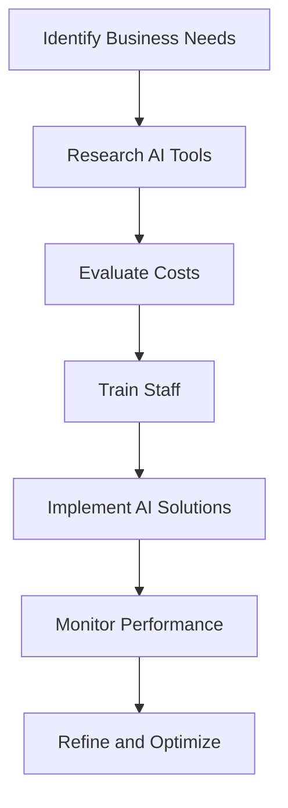

---

# Unlock Business Potential with AI Tools in 2026

In today's fast-paced digital landscape, businesses are increasingly looking towards artificial intelligence (AI) to enhance their operations, improve customer experiences, and drive innovation. With 2026 just around the corner, the question on every entrepreneur's mind is: how can AI for business unlock our potential in the coming years? This article will explore various AI tools, their applications, and how they can serve as powerful catalysts for growth.

## Understanding AI for Business

AI for business refers to the use of artificial intelligence technologies to streamline processes, enhance decision-making, and ultimately improve profitability. This can encompass everything from machine learning algorithms that predict customer behavior to natural language processing tools that enhance communication. 

### Why AI is Essential for Business Growth

1. **Efficiency**: AI can automate repetitive tasks, allowing human employees to focus on more strategic initiatives.
2. **Data Insights**: AI can analyze vast amounts of data quickly, unveiling trends and insights that would be nearly impossible for humans to discern.
3. **Enhanced Customer Experience**: AI tools can personalize customer interactions, leading to increased satisfaction and loyalty.
4. **Cost Savings**: By optimizing processes and reducing human error, AI can lead to significant operational cost savings.

## Popular AI Tools for Businesses in 2026

### 1. Chatbots and Virtual Assistants

**Use Case**: Customer support

Chatbots have revolutionized customer service by providing instant responses to inquiries. Virtual assistants like [ChatGPT](https://chat.openai.com/?ref=AFFILIATE_ID) or Google Assistant can handle basic queries, freeing up human agents for more complex issues.

**Pros**:
- 24/7 availability
- Quick response times
- Cost-effective

**Cons**:
- Limited understanding of complex queries
- Can lead to customer frustration if not programmed correctly

### 2. AI-Powered Analytics

**Use Case**: Market research

Tools like Tableau and Google Analytics leverage AI to provide deeper insights into consumer behavior, enabling businesses to make data-driven decisions.

**Pros**:
- In-depth analysis of customer data
- Predictive analytics that forecast future trends

**Cons**:
- Requires a learning curve to utilize effectively
- Potentially high costs for advanced features

### 3. Automated Marketing Tools

**Use Case**: Targeted advertising

Platforms like HubSpot and Salesforce utilize AI to optimize marketing campaigns by analyzing customer data and predicting engagement.

**Pros**:
- Increases ROI on marketing spend
- Personalized marketing strategies

**Cons**:
- May require significant initial investment
- Can be complicated to set up

### 4. AI-Driven Project Management

**Use Case**: Team collaboration

Tools like Monday.com and Asana use AI to enhance project management by automating task assignments and tracking progress.

**Pros**:
- Improved team productivity
- Enhanced accountability with automated reminders

**Cons**:
- May not integrate easily with existing systems
- Learning curve for team members

## Comparative Analysis of AI Tools

To help you make an informed decision about which AI tools to implement in your business, here’s a comparison of the aforementioned tools:

<table border="1">
  <tr>
    <th>Tool</th>
    <th>Use Case</th>
    <th>Pros</th>
    <th>Cons</th>
  </tr>
  <tr>
    <td>Chatbots</td>
    <td>Customer support</td>
    <td>24/7 availability, Cost-effective</td>
    <td>Limited understanding, Customer frustration</td>
  </tr>
  <tr>
    <td>AI-Powered Analytics</td>
    <td>Market research</td>
    <td>In-depth analysis, Predictive insights</td>
    <td>Learning curve, High costs</td>
  </tr>
  <tr>
    <td>Automated Marketing Tools</td>
    <td>Targeted advertising</td>
    <td>Increased ROI, Personalized strategies</td>
    <td>High initial investment, Setup complexity</td>
  </tr>
  <tr>
    <td>AI-Driven Project Management</td>
    <td>Team collaboration</td>
    <td>Improved productivity, Enhanced accountability</td>
    <td>Integration issues, Learning curve</td>
  </tr>
</table>

## Workflow of Implementing AI Tools

To better understand how to integrate AI into your business, consider the following workflow:

### Steps to Implement AI Solutions

1. **Identify Business Needs**: Start by assessing the areas of your business that could benefit from AI.
2. **Research AI Tools**: Investigate the tools available in the market that align with your needs.
3. **Evaluate Costs**: Consider both the upfront and ongoing costs associated with adopting these technologies.
4. **Train Staff**: Ensure that your team is adequately trained on the new tools to maximize their potential.
5. **Implement AI Solutions**: Roll out the chosen AI tools across your organization.
6. **Monitor Performance**: Regularly review the performance of these tools to ensure they are meeting your business objectives.
7. **Refine and Optimize**: Continuously look for ways to improve the use of AI within your company.

## Conclusion

The integration of AI tools in business is no longer a futuristic concept; it's happening now and will only accelerate in 2026. By harnessing AI for business, you can unlock unprecedented potential, streamline processes, and create a better experience for your customers. 

Are you ready to embrace the future of business with AI? Start exploring your options today to stay ahead of the competition and take your business to new heights!

### Call to Action

Don’t wait to unlock the full potential of your business. Visit our website for comprehensive reviews and guides on the best AI tools available today, and start your journey towards a smarter, more efficient business model!

## 関連記事

- [AI Agents: The Future of Personal Assistants in 2026](/posts/ai-agents-the-future-of-personal-assistants-in-2026/)
- [AI Automation: A Game Changer for Small Businesses](/posts/ai-automation-a-game-changer-for-small-businesses/)
- [AI Automation: The Key to Enhanced Business Efficiency](/posts/ai-automation-the-key-to-enhanced-business-efficiency/)
