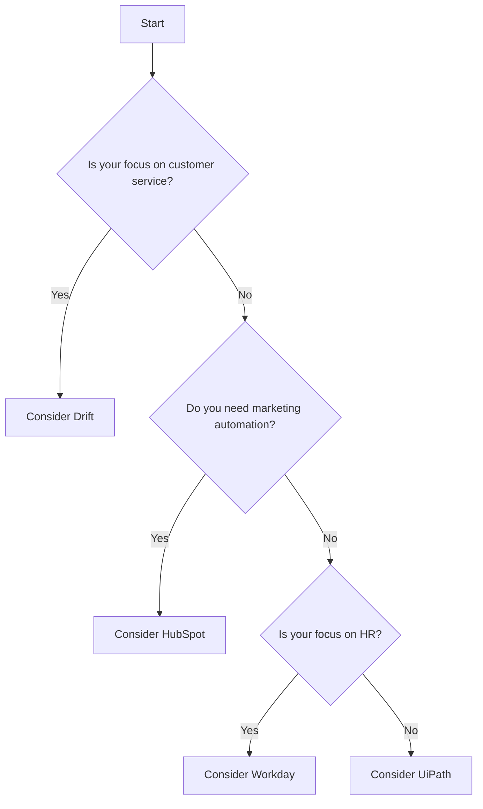

Unlocking Business Efficiency Through AI Automation

In today's fast-paced digital landscape, businesses are under constant pressure to improve efficiency, reduce costs, and enhance customer experience. One of the most transformative technologies to address these challenges is AI automation. By leveraging AI automation for business, organizations can streamline workflows, minimize human error, and provide better service to their clients. Let’s dive into the world of AI automation and explore how it can unlock new levels of efficiency in your organization.

### What is AI Automation?

AI automation refers to the use of artificial intelligence technologies to automate repetitive tasks and processes within a business. This can include everything from customer service chatbots and data entry automation to more complex decision-making processes. The goal is to allow human workers to focus on more strategic tasks while AI handles mundane activities.

### Benefits of AI Automation for Business

1. **Increased Efficiency**: AI can process large amounts of data far quicker than humans, enabling faster decision-making.
2. **Cost Reduction**: By automating routine tasks, businesses can significantly reduce operational costs associated with labor.
3. **Improved Accuracy**: Automated systems minimize the risk of human error, leading to more accurate outcomes.
4. **Enhanced Customer Experience**: AI tools can provide 24/7 customer support, ensuring that customer inquiries are addressed promptly.
5. **Data-Driven Insights**: AI can analyze data patterns, providing businesses with insights that can guide strategic decisions.

### Key Use Cases of AI Automation in Business

#### 1. Customer Service Automation

AI chatbots are becoming increasingly popular in customer service. They can handle FAQs, process orders, and resolve common issues without human intervention. For instance, companies like Zendesk and Drift use AI chatbots to enhance user experience and reduce the workload on human agents.

#### 2. Process Automation

Tools like UiPath and Automation Anywhere enable businesses to automate various workflows, such as data entry, invoice processing, and report generation. This not only speeds up these processes but also frees employees to focus on higher-value tasks.

#### 3. Marketing Automation

AI-driven platforms like HubSpot and Marketo offer automation features that optimize marketing campaigns. They can analyze customer behavior and preferences to deliver personalized content, improving engagement and conversion rates.

#### 4. Human Resources Automation

From recruitment processes to employee onboarding, AI can streamline HR functions. Platforms like Workday use AI to match candidates with job openings, ensuring better hires and reducing time spent on recruitment.

### Pros and Cons of AI Automation Tools

To give you a clearer picture, let’s review some popular AI automation tools and their pros and cons.

<table>
  <tr>
    <th>Tool</th>
    <th>Pros</th>
    <th>Cons</th>
  </tr>
  <tr>
    <td>UiPath</td>
    <td>User-friendly interface, strong community support</td>
    <td>Can be costly for small businesses</td>
  </tr>
  <tr>
    <td>Zapier</td>
    <td>Integrates with thousands of apps, easy setup</td>
    <td>Limited automation capabilities for complex tasks</td>
  </tr>
  <tr>
    <td>WorkFusion</td>
    <td>Combines RPA with AI for complex automation</td>
    <td>Requires technical expertise to implement</td>
  </tr>
  <tr>
    <td>Drift</td>
    <td>Improves customer engagement with AI chatbots</td>
    <td>May not handle complex queries well</td>
  </tr>
</table>

### Choosing the Right AI Automation Tool

When selecting an AI automation tool, consider the specific needs of your business. Here’s a simple decision tree to help you determine which tool might be the best fit:

### Implementation Challenges

While the benefits of AI automation are substantial, the implementation can come with its own set of challenges:

1. **Resistance to Change**: Employees may be hesitant to adopt new technologies. Training and communication are key to overcoming this barrier.
2. **Integration Issues**: Integrating AI tools with existing systems can be complicated and may require the expertise of IT professionals.
3. **Data Privacy Concerns**: Ensuring compliance with data privacy regulations is critical, especially when dealing with customer data.

### Future of AI Automation in Business

The future of AI automation for business is promising. As technology evolves, we can expect to see even more advanced applications of AI, such as predictive analytics that can forecast market trends or AI-driven cybersecurity solutions that protect against data breaches. Investing in AI automation today can position your business for success in an increasingly competitive landscape.

### Conclusion: Take the Leap into AI Automation

AI automation is not just a trend; it’s a game-changer that can unlock unparalleled efficiency and growth for your business. By embracing these technologies, you can streamline operations, enhance customer service, and make data-driven decisions that propel your organization forward. 

Are you ready to harness the power of AI automation for your business? Explore the tools mentioned in this article, assess your needs, and take the first step toward a more efficient future. Don’t wait—start your journey into AI automation today!